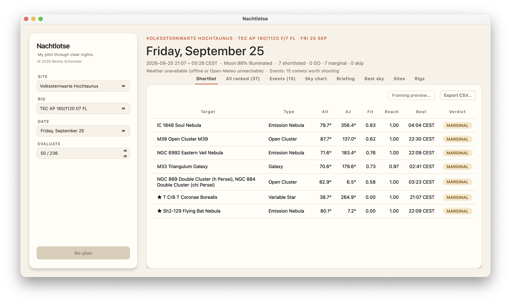
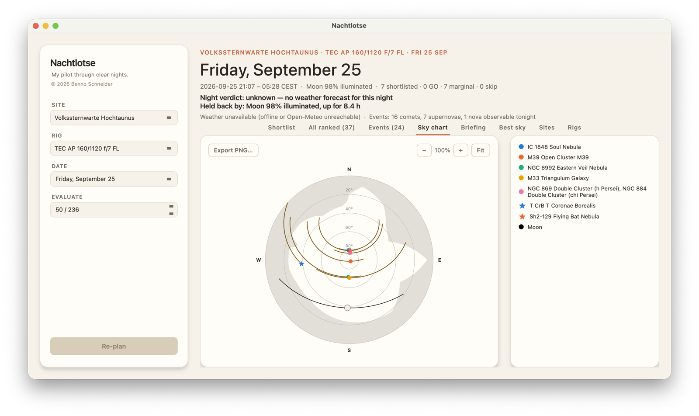

# Nachtlotse


[English](README.md) · Deutsch

Ein Lotse bringt Schiffe sicher durch schwieriges Fahrwasser. Nachtlotse
macht das Gleiche für deine Beobachtungsnacht und beantwortet eine Frage:
Was fotografiere ich heute Nacht?

Du sagst dem Programm, wo du stehst und mit welcher Ausrüstung. Es rechnet
den Himmel über deinem Standort für diese Nacht durch und gibt dir eine
kurze Liste mit Zielen, jedes mit einer Bewertung (GO, MARGINAL oder SKIP)
und der Begründung dazu. Dabei zählen dein echter Horizont, das Bildfeld
deiner Kamera, der Mond, die Wettervorhersage und die Frage, wie dunkel die
Nacht überhaupt wird. Außerdem zeigt es Kometen, Supernovae und Novae, die
gerade hell genug sind, und wie ein Ziel in deinen Bildausschnitt passt.

Die ganze Astronomie wird aus den JPL-Ephemeriden berechnet und gegen
bekannte Werte getestet. Geschätzt wird nichts.

<p align="center">
  
  
</p>

<p align="center"><sub>Derselbe Plan in zwei Ansichten: Volkssternwarte Hochtaunus, TEC AP 160/1120 f/7 FL, die Nacht vom 25. September.</sub></p>

## Dokumentation

Die ausführliche Dokumentation steht im
**[Wiki](https://github.com/beschne/nachtlotse/wiki/Startseite)**, auf
Deutsch und Englisch.

- [Installieren](https://github.com/beschne/nachtlotse/wiki/Installieren) und [Erster Start](https://github.com/beschne/nachtlotse/wiki/Erster-Start)
- [Eine Nacht planen](https://github.com/beschne/nachtlotse/wiki/Eine-Nacht-planen), [Aktuelle Ereignisse](https://github.com/beschne/nachtlotse/wiki/Aktuelle-Ereignisse), [Bildausschnitt](https://github.com/beschne/nachtlotse/wiki/Bildausschnitt), [Bester Himmel](https://github.com/beschne/nachtlotse/wiki/Bester-Himmel)
- [Wie die Rangfolge entsteht](https://github.com/beschne/nachtlotse/wiki/Wie-die-Rangfolge-entsteht) und [Bewertungen](https://github.com/beschne/nachtlotse/wiki/Bewertungen)
- [Befehlsreferenz](https://github.com/beschne/nachtlotse/wiki/Befehlsreferenz)
- [Fehlerbehebung](https://github.com/beschne/nachtlotse/wiki/Fehlerbehebung) und [Fragen und Antworten](https://github.com/beschne/nachtlotse/wiki/Fragen-und-Antworten)

## Schnellstart

Du brauchst macOS und [uv](https://docs.astral.sh/uv/).

```bash
git clone https://github.com/beschne/nachtlotse.git
cd nachtlotse
uv sync
cp nachtlotse/data/sites_local.template.yaml nachtlotse/data/sites_local.yaml
cp nachtlotse/data/rigs_local.template.yaml nachtlotse/data/rigs_local.yaml
# beide Dateien bearbeiten: dein eigener Standort, deine eigene Ausrüstung
uv run lotse plan          # die Liste für heute Nacht auf der Kommandozeile
uv sync --extra gui && uv run lotse gui    # oder die Mac-App
```

## Für Entwickler

Die Quellen der Dokumentation liegen in [`docs/wiki/`](docs/wiki/) und werden
mit `scripts/publish_wiki.py` veröffentlicht. Architektur und Projektregeln
stehen in [CLAUDE.md](./CLAUDE.md), der Stand Modul für Modul in
[STATUS.md](./STATUS.md), die Pläne in [ROADMAP.md](./ROADMAP.md). Diese
Entwicklerdokumente gibt es nur auf Englisch.

```bash
uv run pytest        # Tests (offline, etwa 20 Sekunden)
uv run ruff check .  # Lint
```

## Lizenz

[MIT](./LICENSE)
