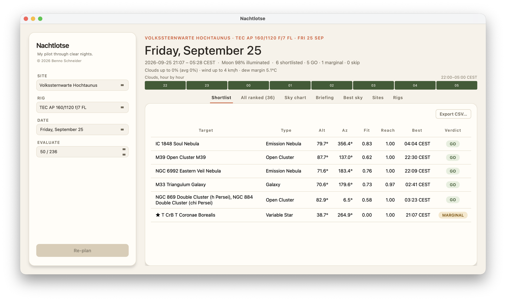
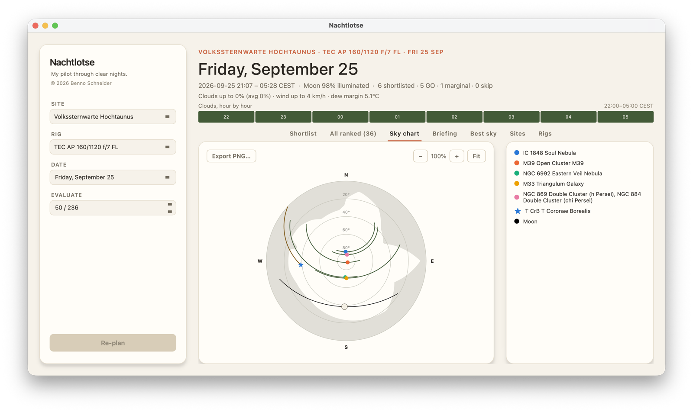

# Nachtlotse


*("Nachtlotse" is German for "night pilot" — like a harbor pilot who guides
ships through difficult waters, but for clear nights and telescopes.)*

> My pilot through clear nights. Answers the oldest question in astrophotography:
> **"What should I shoot tonight?"** — and delivers an honest verdict.

A deterministic session planner **built for astrophotographers**, native on
macOS. It scores tonight's sky over a given site against a given equipment
rig and distills the result down to a short, score-ranked **shortlist** of
targets — each with its own verdict: **GO / MARGINAL / SKIP** — with a
traceable rationale, built on an open, testable engine. Targets close enough
to share one frame of your rig (e.g. M81 + M82) are automatically suggested
as a single co-visible group, not two separate shortlist entries. With more
than one rig configured, a best-rig chooser can also pick whichever one
frames each target best, instead of scoring for a single rig you name. An
optional nightly briefing (Claude API, only when asked for) phrases the
shortlist as prose — the engine's numbers and verdicts still decide
everything. A native GUI (PySide6) is also available — see
[Native GUI](#native-gui) below.

<p align="center">
  
  
</p>

<p align="center"><sub>Same plan, two views — Volkssternwarte Hochtaunus, TEC AP 160/1120 f/7 FL, the night of Friday, September 25.</sub></p>

## Guiding principle

**The engine decides. An LLM formulates at most the prose — never the astronomy.**

Every altitude, every window, every framing number comes deterministically from
`skyfield`/`astroplan` against JPL ephemerides. The engine core
(`nachtlotse/engine/`) is pure Python with no UI, network, or I/O dependency, and
is fully backed by `pytest` against known astronomical values.

## Status

The MVP (M0–M5: engine, multi-site/multi-rig support, weather, and the
GO/MARGINAL/SKIP verdict) is done and history — development has moved on
to the roadmap beyond it. Module-by-module detail and the MVP's
milestone-by-milestone history: [STATUS.md](./STATUS.md). Current
roadmap: [ROADMAP.md](./ROADMAP.md). Architecture and all other
decisions: [CLAUDE.md](./CLAUDE.md).

## Quickstart

Requires [`uv`](https://docs.astral.sh/uv/).

```bash
uv sync                # set up the environment + dependencies
cp nachtlotse/data/sites_local.template.yaml nachtlotse/data/sites_local.yaml
cp nachtlotse/data/rigs_local.template.yaml nachtlotse/data/rigs_local.yaml
                        # then edit both: your own sites/gear, or keep the examples
uv run pytest          # run the tests
uv run ruff check .    # lint
uv run ruff format .   # format
uv run lotse plan      # rank tonight's targets for your first site + rig
uv run lotse sites     # list all configured observing sites
uv run lotse rigs      # list all configured rigs
uv run lotse best-sky  # compare all configured sites' forecast cloud cover tonight

# --site and --rig accept a name or alias (or a unique substring of one),
# and can be combined; either defaults to the first entry in its file:
uv run lotse plan --site "Großer Feldberg" --rig S30P

# --best-rig scores every configured rig per target and keeps only the
# best-scoring one, instead of the single --rig above — useful once you
# have more than one rig and want the planner to pick. Mutually exclusive
# with --rig and --chart; doesn't group co-visible targets (see ROADMAP.md):
uv run lotse plan --best-rig

# --date plans for a given night (YYYY-MM-DD, local to the site) instead
# of tonight — useful for checking ahead. Weather beyond Open-Meteo's
# forecast horizon (16 days) shows as unavailable; the sky-geometry
# ranking and verdict still work for any date, past or future:
uv run lotse plan --site Feldberg --date 2026-11-14

# --type keeps only targets of that category (repeatable — matches any
# one of them): emission_nebula, reflection_nebula, planetary_nebula,
# dark_nebula, galaxy, galaxy_group, open_cluster, globular_cluster,
# variable_star.
uv run lotse plan --type galaxy --type globular_cluster

# Co-visible targets (close enough to share one frame of your rig, e.g.
# M81 + M82 or the Orion Nebula complex) are folded into a single
# shortlist entry automatically — no flag needed, nothing to opt into.

# --limit caps how many catalog objects are evaluated (default: 50, use 0 for all).
# Keeps `lotse plan` fast when the catalog is large; all objects that clear
# basic constraints are still ranked, just the evaluation budget is limited.
# The catalog is loaded brightest-first, so a lower limit gives up the
# faintest objects first, not an arbitrary slice — nothing bright is
# skipped in favor of something fainter. A starred favorite (e.g. T CrB)
# is always evaluated regardless of this limit, wherever it sits in
# catalog order; it can only be missing from a plan if it genuinely
# isn't up tonight.
uv run lotse plan --limit 20
uv run lotse plan --limit 0    # evaluate every catalog object

# --chart writes the shortlist's alt/az polar overview as a PNG (default
# filename: nachtlotse-shortlist.png in the current directory, overwriting
# any existing file there) — or pick your own path. Needs its own extra:
uv sync --extra charts
uv run lotse plan --chart
uv run lotse plan --chart my-plan.png

# --prose prints an LLM-written nightly briefing after the usual
# shortlist/table — phrasing only, every number/verdict still comes from
# the engine. Never called unless you pass this flag. Needs its own
# extra plus an API key; fails loudly (not silently) if either is missing:
uv sync --extra prose
export ANTHROPIC_API_KEY=sk-...
uv run lotse plan --prose

# The API key (and, optionally, which Claude model to use) can live in
# nachtlotse/data/prose_local.yaml instead of the environment variable —
# gitignored, never committed. Copy the template to create it:
cp nachtlotse/data/prose_local.template.yaml nachtlotse/data/prose_local.yaml

# best-sky answers "where's the clearest night", not "what should I shoot":
# it ranks your configured sites by forecast cloud cover in each site's own
# dark window. --radius-km restricts the comparison to sites within that
# distance of --site (default: every configured site, any distance);
# --date takes a single YYYY-MM-DD, same as `plan`, default tonight.
uv run lotse best-sky --site Feldberg --radius-km 50 --date 2026-11-14
```

`uv run <cmd>` runs the command inside the project's own virtual environment
(`.venv`), managed by `uv` — no need to activate it manually.

Without a `sites_local.yaml`/`rigs_local.yaml`, the affected commands exit
with a message pointing at the matching template — the test suite still
passes either way, since it never depends on your local site/rig lists.

On the first test run, `skyfield` downloads the JPL ephemeris `de421.bsp`
(~17 MB) once and caches it in `.cache/skyfield/` (not part of the git repo).
After that, everything runs offline.

Every Open-Meteo forecast is cached per site for 1 hour in
`.cache/open_meteo/` (also not part of the git repo) — a `plan` or
`best-sky` run within that hour reuses it instead of hitting the network
again.

## Native GUI

A native macOS app (PySide6/Qt, no Swift) runs alongside the CLI — ready
for use, not a work-in-progress preview. It doesn't replace `lotse plan`;
the CLI remains the primary front end.

```bash
uv sync --extra gui   # needs PySide6, not installed by default
uv run lotse gui
```

(Screenshots at the top of this README.)

It computes real plans against your own `sites_local.yaml`/`rigs_local.yaml`
(no illustrative/fake data) across six tabs: the shortlist, the full
ranked table, a polar sky chart (tracks colored by verdict, each
target's best-time dot its own color — a star instead of a dot for a
favorite, e.g. T CrB — plus a real Moon track and phase icon), a
nightly-briefing screen (same Claude API opt-in/fail-loud contract as
`--prose` — nothing is sent to Anthropic until you click Generate), a
**Best sky** tab (`best-sky`'s own cross-site cloud-cover comparison,
independent of the currently-planned rig: pick any configured site as
**Center**, an optional **Radius** in km to only compare sites within
that distance — same "0/omitted = every configured site" convention as
`--radius-km` — then Refresh to rank them clearest-first, each row its
site plus region, a "Clouds up to" max/avg reading, and an hourly
cloud-cover sparkline for that site's own dark window (a clear-then-
closes-in night doesn't collapse into the same number as the reverse).
Every row's sparkline lines up on the same hour-by-hour timeline —
whichever site has the longest night that evening — rather than each
scaling to its own hour count, so a shorter night reads as empty cells
at the edges, not a same-width bar that quietly means different clock
hours in different rows. A site with no weather reads as either
"Weather unavailable" (the fetch
itself failed — network/API) or "Beyond forecast range" (fetch fine,
but the picked date is past Open-Meteo's own 16-day forecast horizon)
— told apart rather than one generic unreachable state, and never with
a colored sparkline of its own either way. "Plan this site" on a result
jumps the sidebar straight to it and switches back to the Shortlist),
and a read-only sites/rigs reference — the Sites tab has two controls
on top of that list, neither touching the underlying file: SORT
reorders it (`sites_local.yaml`'s own order by default; by Region; or
by Distance from a chosen reference site, same haversine math as Best
Sky's own Distance column, each card then showing its distance/
bearing), and a REGIONS checkbox row *filters* which sites show at
all — independent of SORT, all checked by default. Handy together for
a growing site list: narrow to one region, then order those by
distance from a candidate new site. The sidebar's
EVALUATE field is the GUI's own `--limit` (see above) — same
brightest-first evaluation order, same unconditional exemption for
starred favorites. See [ROADMAP.md](./ROADMAP.md) for the toolkit
decision (PySide6 over PyObjC/AppKit) and what's still open (an in-app
sites/rigs editor, a GUI catalog/favorites tab, GUI-side exports, among
others).

## Architecture

```
nachtlotse/
├── engine/     # pure, deterministic, testable — no I/O, no network
├── data/       # persistence — sites, rigs, horizons, session log
├── weather/    # optional layer (from M4) — Open-Meteo, TTL-cached
├── charting.py # shared chart geometry, library-agnostic
├── chart_export.py  # CLI's --chart PNG export (matplotlib)
├── best_sky.py # cross-site weather comparison (`lotse best-sky`)
├── prose.py    # LLM nightly briefing (`lotse plan --prose`, opt-in)
├── gui/        # native app (PySide6, `lotse gui`, opt-in extra)
└── cli.py      # the primary front end (see CLAUDE.md)
```

Dependency direction: `cli.py`/`gui/` → `engine`/`data`. The `engine` core
imports nothing from `cli.py`, `gui/`, `data`, or `weather`.

## Tech stack

Python 3.12+ · `uv` · `skyfield` / `astroplan` / `astropy` · `pytest` · `ruff`
· `PySide6` (optional, native GUI)

## License

[MIT](./LICENSE)
